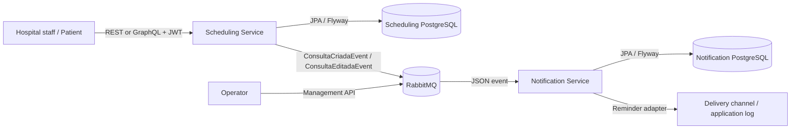
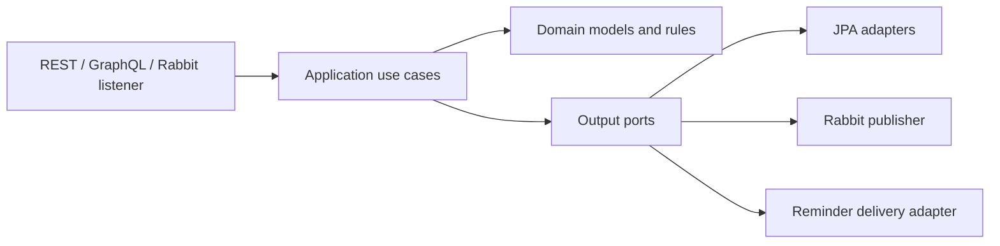
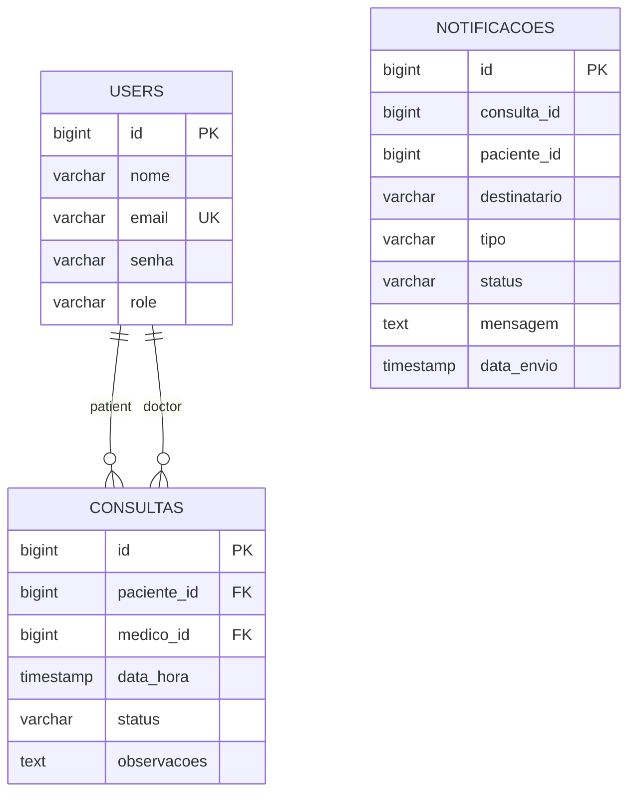

# Architecture

## System context and containers



The services never share a database. The scheduling service owns users and appointments. The notification service receives all required recipient data in the event and owns notification delivery records.

## Internal components

Both services use ports and adapters:



- `domain`: framework-independent models, roles and exceptions.
- `application/usecase`: business orchestration and authorization-by-ownership.
- `application/port/out`: persistence, token, messaging and delivery contracts.
- `infrastructure`: JPA, JWT, RabbitMQ, configuration and delivery adapters.
- `web`: REST/GraphQL controllers, request/response models and error mapping.

## Appointment event sequence

```mermaid
sequenceDiagram
    actor Nurse
    participant API as Scheduling API
    participant DB as Scheduling DB
    participant MQ as RabbitMQ
    participant NS as Notification Service
    participant NDB as Notification DB
    Nurse->>API: POST /consultas (Bearer JWT)
    API->>API: Validate roles, future date, conflict
    API->>DB: Save appointment
    API->>MQ: Publish ConsultaCriadaEvent JSON
    API-->>Nurse: 201 Created
    MQ->>NS: Deliver event
    NS->>NS: Build and send reminder
    NS->>NDB: Persist SENT or FAILED attempt
    Note over MQ,NS: Retry failures; exhausted messages go to DLQ
```

## Data model



`NOTIFICACOES` is intentionally in a different database and therefore has no cross-service foreign key.

## Architecture decisions

### ADR-001 — Database per service

Each service owns a PostgreSQL database. This preserves deployment autonomy and prevents direct coupling. Data needed by notifications travels in events.

### ADR-002 — Asynchronous notification integration

RabbitMQ decouples scheduling latency and availability from reminder delivery. JSON event classes and routing constants live in `common`; retry and DLQ policies prevent poison messages from blocking the queue.

### ADR-003 — JWT and role rules at the boundary

The scheduling API is stateless. Spring Security authenticates JWTs and method authorization declares allowed roles. Use cases additionally enforce patient ownership because that rule depends on business data.

### ADR-004 — Logical cancellation and history

`DELETE /consultas/{id}` changes status to `CANCELADA`; it does not physically delete the row. This preserves the medical history and emits an update event.

### ADR-005 — Stable Portuguese external contract

Java package, class and internal component names are English. Names explicitly required by the challenge remain Portuguese at system boundaries so existing clients and the documented evaluation contract do not break.
